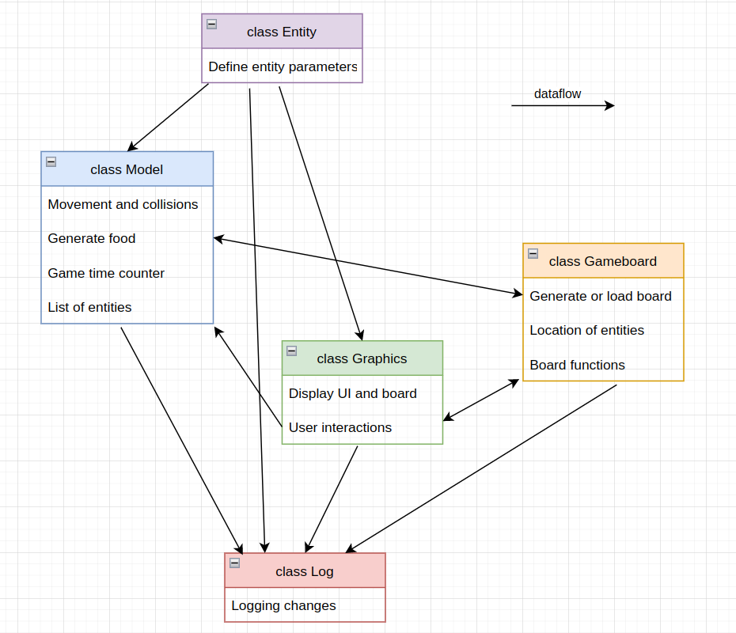

<h2>class model.Entity</h2>

*    defines parameters of entities
        * name
        * vision
        * movement reach
        * target (food / reproduction)
        * texture
        * age
        * age limit

<h2>class model.Model</h2>

*    Logic of the simulation
*    Handles movement of entities and collisions
*    Generates food on game board
*    Counts game time
*    Operates with current list of entities

<h2>class graphics.Graphics</h2>

*    Displays UI and game board with entities
*    Handles user interactions (changing simulation parameters, camera view, ...)
*    Can save game state to picture

<h2>class board.Gameboard</h2>

*    Can generate new board or load predefined one
*    Handles what each game board field contains (entities / land type / food)
*    Functions to count distance between game board fields / nearest food location

<h2>class Log</h2>

*    Logging of everything
